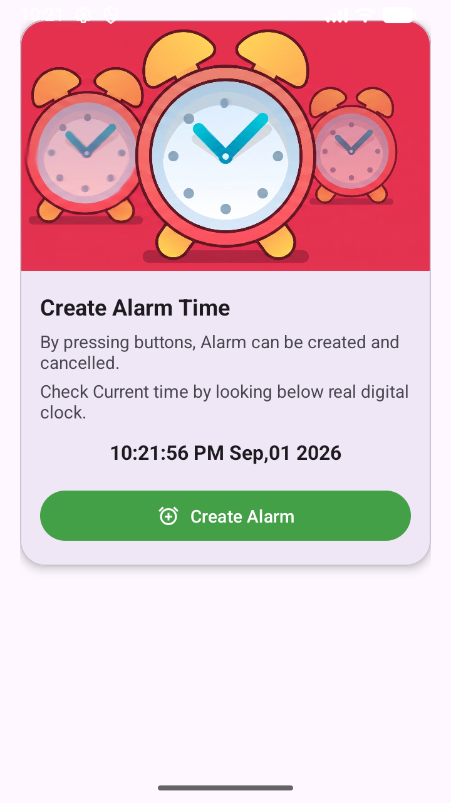
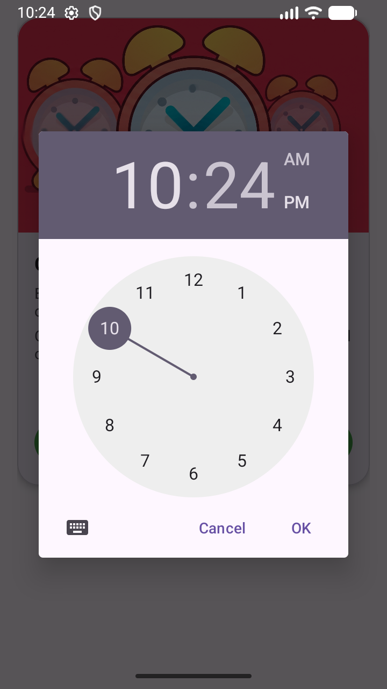
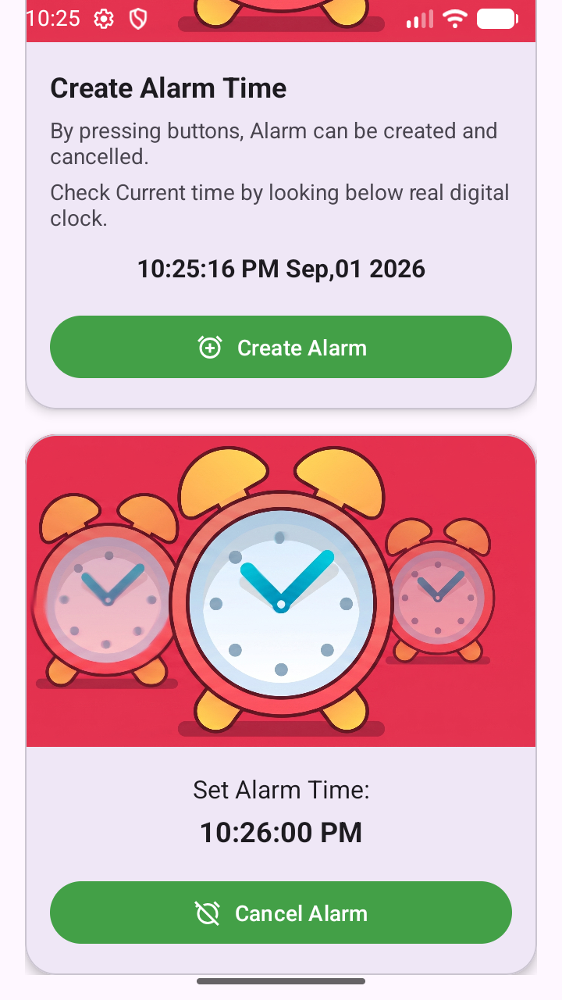
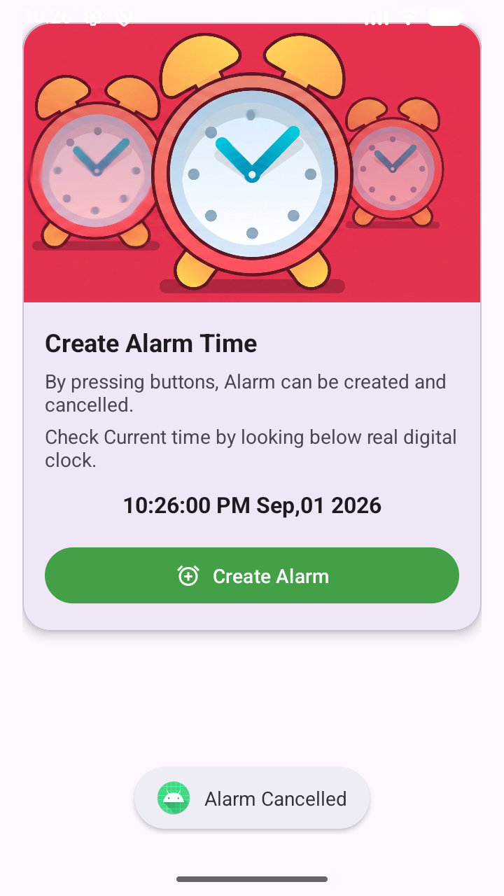

# Practical-4

## AIM

Create an Android **Alarm Application** using **Service** and **BroadcastReceiver**.

---

The application allows the user to select a time and set an alarm. The alarm is scheduled using `AlarmManager`. When the scheduled time is reached, a `BroadcastReceiver` receives the alarm broadcast and starts a `Service` to perform the alarm action.

### Key Components:
- **MainActivity**: The user interface where users can select a time using a `TimePickerDialog`. It calculates the remaining time and schedules the alarm.
- **AlarmManager**: Used to schedule the alarm at a precise time, even if the application is not running.
- **AlarmBroadcastReceiver**: A background component that wakes up when the alarm triggers. It receives the intent from `AlarmManager` and starts the `AlarmService`.
- **AlarmService**: A background service that manages the playback of the alarm ringtone using `MediaPlayer`. It ensures the music continues playing until the user cancels it.
- **Material Design UI**: Uses `MaterialCardView`, `MaterialButton`, and `TextClock` for a modern, responsive user interface.

## Screenshots

<table>
  <tr>
    <td></td>
    <td></td>
    <td></td>
  </tr>
  <tr>
    <td colspan="3" align="center"></td>
  </tr>
</table>

---

## 🎯 Objectives

- Create an Android Alarm Application.
- Design the Main Activity according to the given UI.
- Understand and implement `BroadcastReceiver`.
- Understand and implement Android `Service`.
- Use `AlarmManager` to schedule alarms.
- Use `PendingIntent` with `AlarmManager`.
- Use `TimePickerDialog` to select alarm time.
- Use `Calendar` to calculate alarm time.
- Use `SimpleDateFormat` to format and display time.
- Use `TextClock` to display the current time.
- Use `MediaPlayer` to play an alarm sound.
- Start and stop a Service.
- Send and receive Broadcast messages.
- Use `Intent.putStringExtra()` and `Intent.getStringExtra()`.
- Understand `MaterialCardView`.
- Add `SCHEDULE_EXACT_ALARM` permission in the Manifest.

---

# 🛠️ Technologies Used

| Technology | Purpose |
|---|---|
| Android Studio | Development Environment |
| Java / Kotlin | Programming Language |
| XML | User Interface |
| AlarmManager | Schedule alarms |
| PendingIntent | Trigger alarm operation |
| BroadcastReceiver | Receive alarm broadcast |
| Service | Perform background alarm operation |
| MediaPlayer | Play alarm sound |
| TimePickerDialog | Select alarm time |
| Calendar | Manage date and time |
| SimpleDateFormat | Format date/time |
| TextClock | Display current time |
| MaterialCardView | Design UI cards |

---

# ⏰ Application Features

The Alarm Application provides the following functionality:

1. Display the current time.
2. Select an alarm time using `TimePickerDialog`.
3. Schedule an alarm using `AlarmManager`.
4. Receive the alarm using `BroadcastReceiver`.
5. Start the alarm `Service`.
6. Play an alarm sound using `MediaPlayer`.
7. Stop the alarm Service when required.

---

# 🔄 Working of the Application

The basic working flow is:

```text
User Opens Application
        ↓
MainActivity
        ↓
Select Alarm Time
        ↓
TimePickerDialog
        ↓
Create Calendar Time
        ↓
AlarmManager
        ↓
PendingIntent
        ↓
BroadcastReceiver
        ↓
AlarmService
        ↓
MediaPlayer
        ↓
Play Alarm Sound
```

---
**Enrollment No:** 24012011117

**Practical:** 04
